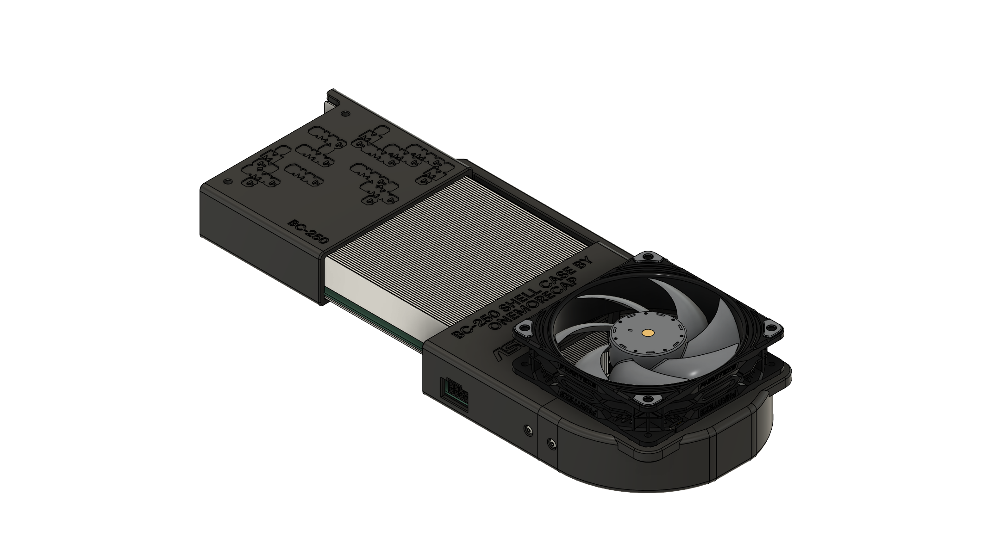

# ASRock AMD BC-250 Shell Case

The Shell Case is a simple and effective solution for organizing cooling on the **ASRock AMD BC-250** module. This snap-on shell allows you to mount a single fan quickly and securely without modifying the card or its case.

The model requires minimal post-processing—just a couple of heated inserts and fasteners, and it's ready to go. The friction-fit design ensures a snug and stable attachment without additional tools or adhesives.

With this cooling shell, you can get **reasonably good cooling performance** for the BC-250, making it a must-have for anyone using this accelerator in a workstation or server environment.

The files provided here include a **front shell**, a **rear shell** (split into two parts), a **handle**, and a shell **connector**—a total of five parts.

### **Compatibility**

This shell is designed specifically to house the **Mean Well LOP-300-12 PSU**, which fits neatly inside. The design ensures that the PSU is securely enclosed while maintaining proper airflow for cooling. However, it is also compatible with other power supplies, which can be used externally if needed.

### Required Hardware

Heated Inserts:

**M3x3x5** or **M3x4x5** – *20 pcs*

Fasteners:

- **M3x6** ISO 7380-1 – *16 pcs*
- **M3x10** ISO 7380-1 – *7 pcs*

Power socket:

**IEC C14** – *1 pcs*

Rubber feet:

**12x6 mm** - 4 pcs

### Material Recommendations

It is best to print this shell using **heat-resistant materials** such as **PETG**, **ABS**, **etc**, as they can withstand higher temperatures without deformation. However, if you have chosen the right fan, regular PLA will also work quite well.

### Print Instructions

All shell parts should be printed in a **vertical orientation**, with the open sides facing **up**. It is recommended to use **both inner and outer brims** for all shell components to ensure proper adhesion and stability. For the **handle** and **rear part of shell**, enable **supports** (build plate only).

For a cool looking, robust texture, you can use the fuzzy skin setting with a 0.2/0.2 configuration. However, keep in mind that this significantly increases print time.

### Fan Recommendations

This shell is designed to accommodate **a single 120mm fan** for cooling the **ASRock AMD BC-250**.

- **Size:** 120x120x25mm (or thicker if space allows)
- **Mounting:** Standard 105mm hole spacing
- **Connector:** 4-pin PWM

For the best cooling performance, prioritize **fans with high static pressure** (measured in **mm H₂O**) rather than just airflow (CFM). **Fans with speeds above 2000 RPM** are recommended for efficient cooling.

Suggested Fans:

- **Phanteks T30** – High-performance, (Advanced mode)
- **Arctic P12 Max** – Strong pressure, good noise-to-performance ratio
- **Arctic S12038-4K** – Industrial-grade, extremely high RPM
- **Noctua NF-F12 industrialPPC-3000 PWM** – Industrial-grade, high-end

These fans provide excellent airflow through restrictive environments, ensuring effective cooling for the BC-250.
